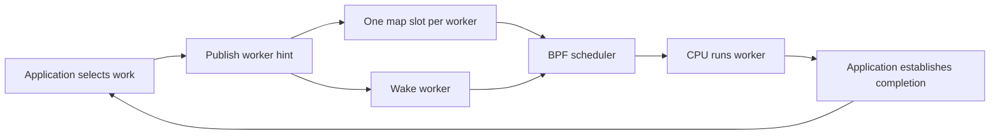

# Scheduler architecture

scx_fresh schedules enrolled Linux threads using metadata describing their
currently selected work. It does not select application messages or perform
application processing.

## Responsibility boundary

The following contract guides the generic scheduler design. The current
implementation still has the legacy behavior described below.

| Owner | Decisions |
| --- | --- |
| Architect | CPU allocation and affinity, service precedence and protection requirements, permitted adaptations, budget limits, and definitions of useful outcomes. |
| Application runtime | Dependency readiness, optional remaining-chain estimates, propagation of timing requirements, and work admission, dropping or cooperative cancellation. |
| BPF scheduler | CPU service for runnable workers, using selected-work metadata and enforcing configured service rules and resource limits. |

The runtime owns the work graph and work selection; the scheduler owns CPU
scheduling. A deadline miss does not authorize the scheduler to cancel
application work. Expiry and the decision to continue late work belong to the
application. Sensor or stage identity must not select service.

A runtime may supply a job deadline directly. Graph analysis and remaining-chain
estimates are optional ways to derive it, not requirements of the hint interface.
Dropping queued work does not imply permission to interrupt a running callback;
the runtime remains responsible for its message, resource and completion lifetimes.

## Service model under design

A service class describes configured CPU treatment, independent of application
function. It is a policy inside SCHED_EXT, not another Linux scheduling class.
Class precedence expresses the architect's priorities. Within a deadline-ordered
class, an earlier-deadline job should preempt a later-deadline job when they
compete for the same CPU. Hints must not bypass configured class permissions or
resource limits. This same-class preemption is not implemented by the current Deadline
path.

Ownership, job budgets and service classes are separate concepts. Ownership
protects the selected-work lifecycle; it does not grant unlimited CPU service.
A per-job execution budget is not a periodic CPU reservation. Its exhaustion
alone does not specify when the worker may receive service again.

Background and budget-exhausted workers need an explicit progress rule. A
replenished allocation is a candidate, not an implemented guarantee. Before
adding it, define whether the allocation belongs to a worker or a class, its
replenishment interval, and its interaction with per-job limits and overload.
Guaranteed background service would consume capacity that higher classes cannot
also claim. Automatic promotion merely because a worker has waited is not the
proposed recovery mechanism.

Treatment of missing deadlines and deadline ties also needs an explicit rule.
These choices must be settled before claiming predictable service; the current
implementation provides neither reservations nor admission-based timing guarantees.

## Current implementation

| Component | Responsibility |
| --- | --- |
| Application | Select work, derive timing requirements, reject obsolete work, and establish completion. |
| MIT hint interface | Describe one selected job per worker and publish it to the map. |
| GPL BPF scheduler | Route runnable threads, order queues, account CPU execution, and apply demotion. |
| GPL loader | Configure and attach the scheduler, pin maps, and read events. |

The map is metadata transport, not an application queue. A later arrival cannot
overwrite a running job's slot. The [hint contract](HINTS_API.md) specifies the
publication and ownership ordering.

## Scheduling scope

The default build uses partial-switch mode: only SCHED_EXT threads enter this
scheduler. CPU affinity constrains where a thread may execute; it does not
exclude unrelated work. Other scheduling classes and interrupt work remain
outside this policy's control.

The [current policy](SCHEDULER.md) has three explicit service classes: Urgent,
Deadline and Background. Application stage IDs are diagnostic only. Classes
are fixed policy choices, not configurable reservations. Map write permissions
control who may publish hints; per-worker class authorization is not implemented.

| Current mechanism | Difference from the intended contract |
| --- | --- |
| Urgent class selects the dedicated queue and wakeup preemption | Implemented independently of stage identity. |
| Deadline effective-deadline ordering without wakeup preemption | Same-class earlier-deadline preemption needs implementation and validation. |
| Age demotion of unowned work to STALE | Expiry must remain an application decision without stranding the selected owner. |
| Job-budget overrun demotes Deadline to Background; Urgent routing is exempt | Exemptions now follow class; subsequent service still needs a defined rule. |
| Strict dispatch precedence and an optional Background slice cap | Neither establishes a minimum service allocation for lower queues. |

Generic class selection is implemented. Same-class deadline preemption, removal
of age demotion, class permissions and replenished service remain future changes.
The hint and scheduler references describe the current ABI and routing rules.

## Limits

Strict priority can starve lower queues. Budget demotion does not cancel work,
and the ownership flag prevents age demotion but not budget demotion. Neither
feature provides a hard real-time guarantee. The scheduler does not control
GPU/ISP execution, synchronize measurements, or migrate an application job
between workers. Kernel fallback on scheduler failure is not a timing guarantee.

See [usage](USAGE.md) for build, attachment, and non-attaching tests. The
application integration and evaluation remain in
[scx-slam-fresh](https://github.com/seldak/scx-slam-fresh).
